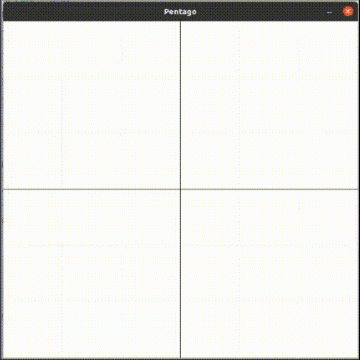

# Pentago with Deep Reinforcement Learning

This repository contains two main parts to simulate Pentago game environment and 
solve it with a Deep RL agent called DQN:

    ├── environment
        └── gym_pentago
            ├── gym_pentago
                ├── envs
                    ├── __init__.py
                    └── pentago.py
                ├── __init__.py
                └── pent_view_2d.py
            ├── README.md
            └── setup.py
    ├── agent
        ├── Base_Agent.py   
        ├── Base_Exploration_strategy.py         
        ├── Config.py
        ├── DQN.py
        ├── Epsilon_Greedy_Exploration.py
        ├── Replay_Buffer.py
        └── Trainer.py
    └── main.py

### Environment Directory
Environment directory contains a customized OpenAI Gym RL Environment for Pentago board game.
There is more about Pentago and how it is simulated by my Gym environment in directory's README.md.
fileeeeeeeeeeeeeeee



ax gym , ax pentago

### Agent Directory 
Agent directory contains several files including PyTorch implementation of DQN algorithm to interact with
the featured environment and solve the game.
DQN is a Deep RL method introduced by Mnih et al. The entire article is accessible by the link below:

*Deep Q Learning (DQN)* <sub><sup> ([Mnih et al. 2013](https://arxiv.org/pdf/1312.5602.pdf)) </sup></sub>


imageeeeeeeeeeeeee for RL, pytorch

Most of the agent is adopted from the following project by Petros Christodoulou et al.:
https://github.com/p-christ/Deep-Reinforcement-Learning-Algorithms-with-PyTorch

## Requirements
It is implemented and tested on a Unix-based OS,
so it is highly recommended to run on such systems to see full options.
It should work on Python 3.8+. It requires pygame, numpy, pytorch and gym libraries.

## Usage
1. First clone the entire repository:
```bash
git liiiiiiink
```

2. Then install Pentago environment with the help of README.md file in Environment directory.


3. Finally, watch the agent learning the game by running main.py file:
```bash
python3 main.py
```
