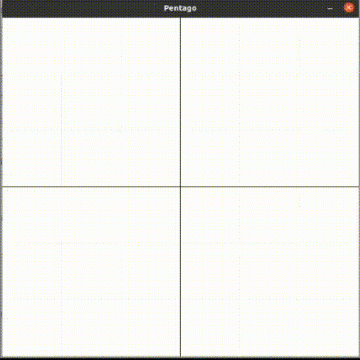

# Pentago with Deep Reinforcement Learning

This repository contains two basic directories and a main file to simulate Pentago environment and 
solve it with a Deep RL agent called DQN.


## Main structure

    ├── agent
        ├── Base_Agent.py   
        ├── Base_Exploration_strategy.py         
        ├── Config.py
        ├── DQN.py
        ├── Epsilon_Greedy_Exploration.py
        ├── Replay_Buffer.py
        └── Trainer.py
    ├── environment
        └── gym_pentago
            ├── gym_pentago
                ├── envs
                    ├── __init__.py
                    └── pentago.py
                ├── __init__.py
                └── pent_view_2d.py
            ├── README.md
            └── setup.py
    └── main.py


### Agent Directory 
Agent directory contains several files including PyTorch implementation of DQN algorithm to interact with Pentago environment and solve the game.
DQN is a Deep RL method introduced by Mnih et al. in 2013. The entire article is accessible by [this link](https://arxiv.org/pdf/1312.5602.pdf).
For the implementation of this agent, the python files in [this repository](https://github.com/p-christ/Deep-Reinforcement-Learning-Algorithms-with-PyTorch) provided by Petros Christodoulou et al. is highly used.

              


### Environment Directory
Environment directory contains a customized Gym environment for Pentago board game.
There is more about Pentago and how it is simulated by this environment in [README](https://github.com/khoramian/Pentago-with-Deep-Reinforcement-Learning/blob/main/environment/gym-pentago/README.md) file of the directory.

          


## Requirements
It is implemented and tested on a Unix-based OS,
so it is recommended to install on such systems to see full options.
It should work on Python 3.8+ and requires gym, pygame, pytorch and numpy libraries.


## Usage
1. First clone the entire repository:
```bash
git clone https://github.com/khoramian/Pentago-with-Deep-Reinforcement-Learning.git
cd Pentago-with-Deep-Reinforcement-Learning
```

2. Then install Pentago environment with the help of [README](https://github.com/khoramian/Pentago-with-Deep-Reinforcement-Learning/blob/main/environment/gym-pentago/README.md) file in Environment directory.


3. Finally, watch the agent learning the game by running main.py file in base directory:
```bash
python3 main.py
```


