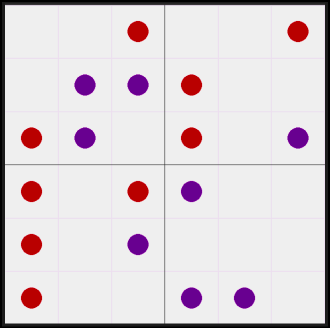
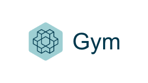

# gym-pentago

A 2D simulated environment for Pentago (aka Pentaball), a strategy board game invented by Tomas Flodén.
The game is for two players with four 3×3 grids arranged into a larger 6×6 grid.
In each turn a player can place a marble in an empty position and rotate a grid by 90° clockwise (except for the grid in which the marble is just set).
The first to place five (or more) marbles in a sequence is the winner. The sequence can be in any vertical, horizontal or diagonal way.

          

### Action space
The agent may choose a (x, y, grid) tuple. The (x, y) is the position of marble and the (grid) is showing target quarter to rotate.
If the position were already used, environment would take no action. 

### Observation space
The observation space is a list of 36 scalars representing all positions on the board.
Each list member shows one of the numbers -1, 0 or 1 as empty, agent or environment place, respectively.

### Reward
If the agent won, it would receive +30 points and -30 in case of lost.
A reward of -1 is given when the agent chooses an occupied position.
The reward remains 0 for a normal move or a final draw (when no one or both the agent and environment win).

### End condition
The game ends if one or both of the agent and environment win or when all positions are used so that no more move is possible.


## Pentago Versions

### Rotatable grids
* All four grids
* All the grids except for the one holding the last marble (Used in implemented version)

### Rotation of the grids
* Clockwise (Used in implemented version)
* Anti-Clockwise
* Both directions

## Copy Right
Following link provided by Matt Chan is highly used to design and implement this environment:
https://github.com/MattChanTK/gym-maze

## Installation
It is implemented and tested on a Unix-based OS,
so it is highly recommended to install on such systems to see full options
(such render problems or any unpredicted consequences on Windows and any other OS is possible).
It should work on Python 3.8+ and requires pygame and numpy.

```bash
cd environment/gym-pentago
sudo pip3 install -e .
```

## Usage
Once installed the package, you can use this customized Gym environment by adding the following lines
to your code:

```bash
import gym
import gym_pentago

env = gym.make('pentago-v0')
```

## Uninstallation
Use following command to remove the entire package:

```bash
sudo pip3 uninstall gym-pentago
```
